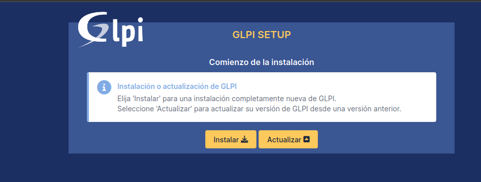
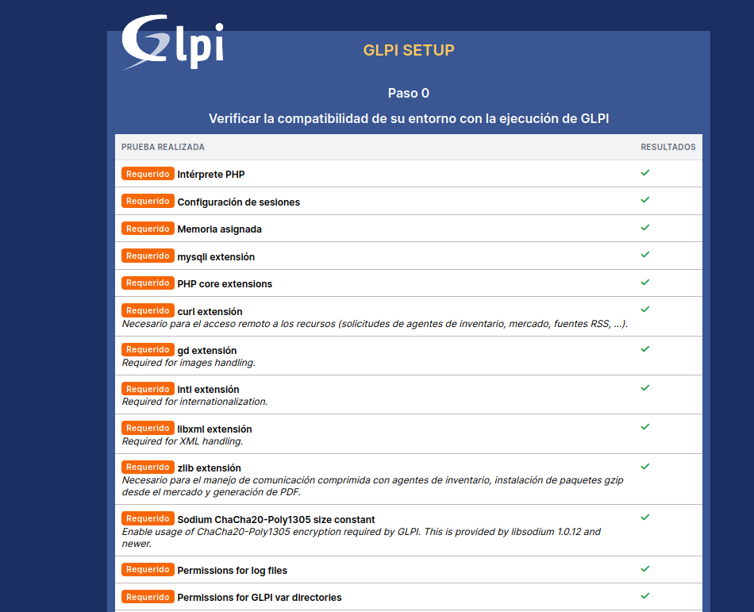
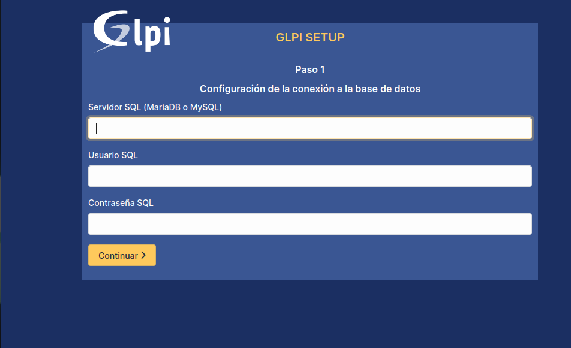
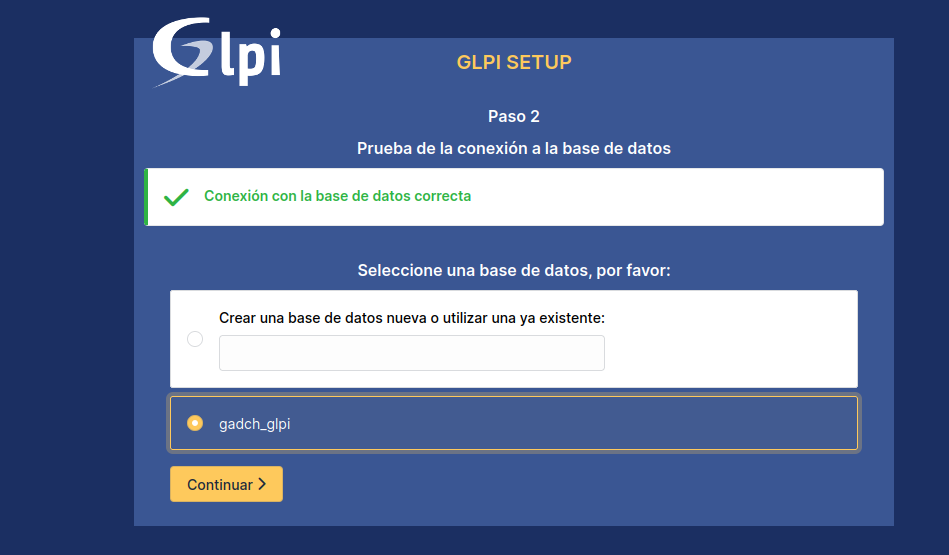
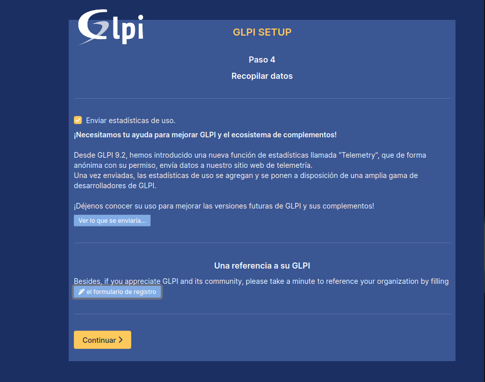
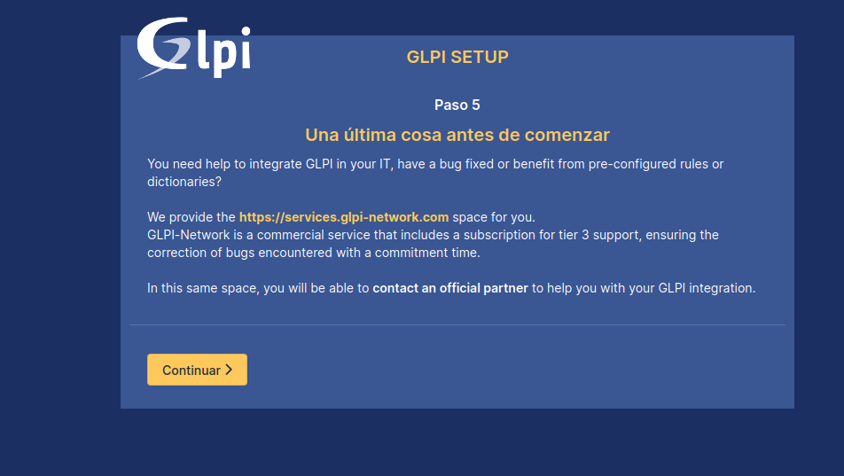
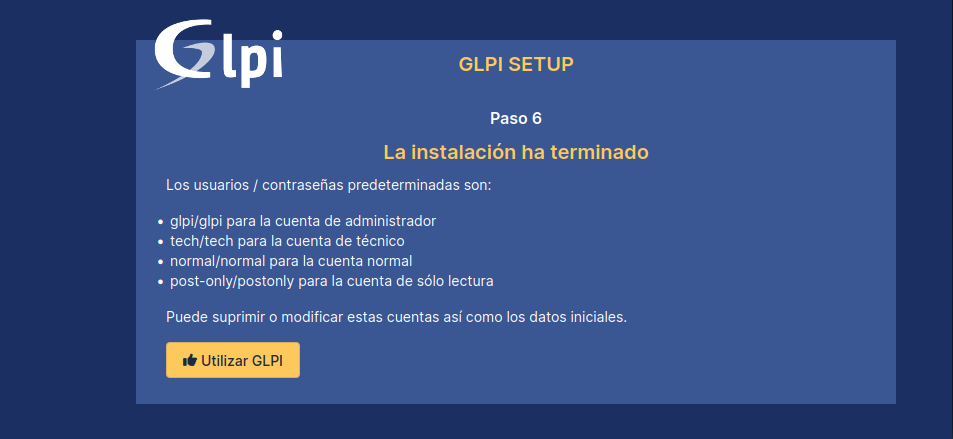

Guía de:

# Instalacion de GLPI

## ACERCA DE:

Versión: 1.0.0

Nivel: Medio

Área: C.P.D.

Elaborado por: Edmundo Céspedes Ayllón

e-mail: [ed.cespedesa@gmail.com](ed.cespedesa@gmail.com)

---

## Instalacion de Prerequisitos

```bash
sudo dnf -y install httpd vim wget unzip
```

### Instalacion de php y modulos requeridos

```bash
sudo dnf install php-{mysqlnd,gd,intl,ldap,apcu,xmlrpc,opcache,zip,openssl,domxml,cli}
```

### Configuracion de `php.ini`

```shell-session
memory_limit = 64M ;        // max memory limit
file_uploads = on ;
max_execution_time = 600 ;  // not mandatory but recommended
session.auto_start = 0 ;
session.use_trans_sid = 0 ; // not mandatory but recommended
```

### Habilitar servicios

```bash
sudo systemctl enable --now httpd php-fpm
```

### Habilitacion de sercvion en el firewall

```
sudo firewall-cmd --zone=public --add-service=http --permanent
sudo firewall-cmd --reload
```

### Habilitacion de servicios en selinux

```
sudo setsebool -P httpd_can_network_connect on
sudo setsebool -P httpd_can_network_connect_db on
sudo setsebool -P httpd_can_sendmail on
```

## Configurando base de datos

```sql
CREATE USER 'glpi'@'%' IDENTIFIED BY 'glp1.gadCh';
GRANT USAGE ON *.* TO 'glpi'@'%' IDENTIFIED BY 'glp1.gadCh';
CREATE DATABASE IF NOT EXISTS `gadch_glpi` ;
GRANT ALL PRIVILEGES ON `gadch_glpi`.* TO 'glpi'@'%';
FLUSH PRIVILEGES;
```

## Descarga de la ultima version de GLPI

```bash
wget https://github.com/glpi-project/glpi/releases/download/10.0.3/glpi-10.0.3.tgz
```

### Extraccion del GLPI

```bash
tar xvf glpi-10.0.3.tgz
```

### Cambio de permisos

```bash
sudo chmod -R 755 glpi
```

### Cambio propietario y grupo

```bash
sudo chown -R apache:apache /var/www/html/glpi
```

### Cambio de ubucacuin del directorio

```bash
sudo mv -fv glpi /var/www/html
```

### Permiso de SELinux para GLPI

```bash
sudo dnf -y install policycoreutils-python-utils
sudo semanage fcontext -a -t httpd_sys_rw_content_t "/var/www/html/glpi(/.*)?"
sudo restorecon -Rv /var/www/html/glpi
```

### Configuracion VHost

Apache

```bash
sudo vim /etc/httpd/conf.d/glpi.conf
```

Configuracion a insertar

```shell-session
<VirtualHost *:80>
   ServerName [ip_o_fqdn_servidor]
   DocumentRoot /var/www/html/glpi

   ErrorLog "/var/log/httpd/glpi_error.log"
   CustomLog "/var/log/httpd/glpi_access.log" combined

   <Directory> /var/www/html/glpi/config>
           AllowOverride None
           Require all denied
   </Directory>
   <Directory> /var/www/html/glpi/files>
           AllowOverride None
           Require all denied
   </Directory>
</VirtualHost>
```

reinicio servicio httpd

```bash
sudo systemctl restart httpd
```

## Configuracion Inicial

### Ingreso al sistemas

```url
http://ServerIP_or_Hostname
```

### Configuraciones

Eleccion del lenguage


Aceptacion de Licencia


Sleccion de tipo de instalacion



Requisitos del sistema GLPI



Conexion a la base de datos



Bases de datos existentes con el acronimo `glpi`



Inicializando la dase de datos


Opcion de envio de informacion recopilatoria del uso del sitema



Avoiso para integracion del sistema



Finalizacion de instalacion del sistema y cuentas por defecto



Cuentas GLPI

```she
- glpi/glpi para la cuenta de administrador
- tech/tech para la cuenta de técnico
- normal/normal para la cuenta normal
- post-only/postonly para la cuenta de sólo lectura
```

Acceso al sistema

```url
http://[ip_servidor]
```

---

## Instalación de Agente GLPI

### Windows

Descargar el glpi-agent

[Releases · glpi-project/glpi-agent · GitHub](https://github.com/glpi-project/glpi-agent/releases) 

Instalar el glpi-agent

Instalación GLPI  

1 Typical

2 [http://192.168.200.56/](http://192.168.200.56/) 

3 Navegador: localhost: 62354 (carga)  

4 Force an inventory  

5 Back  

6 Localhost:62354/status

#### Troubleshooting

Error 2503,2502 entrar a:  

Unidad C: /Windows/Temp 
Borro lo que hay adentro

Entrar propiedades de temp

Fichero de Seguridad (entrar)

Click en el usuario q se este usando (fijarse en configuración)

Seleccionar el usuario y editar

Seleccionar el usuario otra vez y seleccionar control total y aceptar todo

### Linux

Descargamos el glpi-agent

```bash
wget https://github.com/glpi-project/glpi-agent/releases/download/1.4/glpi-agent-1.4-with-snap-linux-installer.pl
```

Instalamos el glpi-agent

```bash
sudo perl glpi-agent-1.4-with-snap-linux-installer.pl --install
```

```bash
sudo vim /etc/glpi-agent/agent.cfg
```

```bash
sudo vim /etc/glpi-agent/inventory-server-plugin.cfg
```

```bash
sudo vim /etc/glpi-agent/toolbox-plugin.cfg
```

```shell-session
# By default, a plugin is always disabled unless "disabled" is set to "no" or "0".
# You can uncomment the following line or set it in included configuration file
# at the end of this configuration
#disabled = no

# Set base url matching for API
#url_path = /toolbox

# Port on which to listen for inventory requests, default to legacy port
#port = 0

# YAML file of the toolbox base configuration
#yaml = toolbox.yaml

# We don't authorize raw yaml edition by default
#raw_edition = no

# PNG logo replacement, max size, 200x55
# Can be a full path or a relative path to share/html
#logo = toolbox/logo.png

# Color for header background of pages, in 'rrvvbb' format using hex digits,
# ffffff is white, ff0000 is red, 0000ff is blue, ...
#headercolor =

# The plugin navbar can include the following link as last navigation link
# The format is the full http link with a text to show separated with a pipe
#addnavlink = http://localhost:62354/|Local agent

# You should create and define you specific parameter in the following
# included configuration file to override any default.
# For example just set "disabled = no" in it to enable the plugin
#include "toolbox-plugin.local"
disabled = no
```

```bash
sudo cp -pfv  /etc/glpi-agent/inventory-server-plugin.cfg /etc/glpi-agent/inventory-server-plugin.local
```

```bash
sudo systemctl start glpi-agent.service
```

```bash
sudo systemctl enabled glpi-agent.service
```
