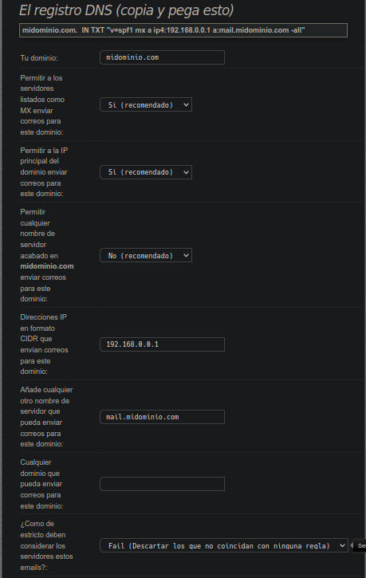
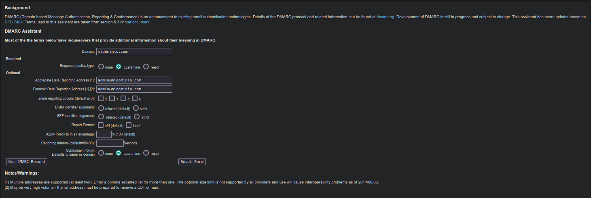
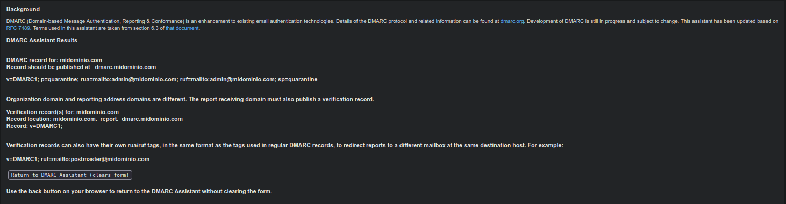

Guía de:

# Reputacion Zimbra

## ACERCA DE:

Versión: 1.2.0

Nivel: Medio

Área: C.P.D.

Elaborado por: Edmundo Céspedes Ayllón

e-mail: [ed.cespedesa@gmail.com](ed.cespedesa@gmail.com)

---

## SMTP BANNER

Es una cadena de texto que utiliza el servidor Zimbra 
para saludar a otros servidores, en la entrega de un correo

Configuramos el smtp banner

```bash
sudo su - zimbra -c "zmprov ms `zmhostname` zimbraMtaSmtpdBanner [fqdn.servidor]" 
```

Reinicio del servidor

```bash
sudo su - zimbra -c "zmcontrol restart"
```

## Registro SPF

El registro SPF es uno de los registros TXT con relación al correo más importante con el que debemos contar en nuestro DNS.

### Generamos Registro SFP

Se puede generar de forma manual  o por medio de un asistente en linea como

[spfwizard](https://www.spfwizard.net/index.php/?lang=es)



En la parte superior muestra como va quedando el registro **TXT** a medida que vamos escogiendo las opciones.

### Descripción de cada opción:

**Tu dominio:  [mi_dominio]** 

Especifica por supuesto el dominio en cuestión, atención, es solo el dominio, nada de alias.

**Permitir a los servidores listados como MX enviar correos para este dominio: Si (recomendado)**

Especifica que los servidores declarados como MX por supuesto puedan enviar correos.

**Permitir a los servidores listados como MX enviar correos para este dominio: Si (recomendado)**

Permite que la propia dirección IP del servidor pueda enviar correos.

**Permitir cualquier nombre de servidor acabado en ntw.nat.cu enviar correos para este dominio: No (recomendado)**

Si especificáramos Si, entonces cualquier alias tendría permitido 
enviar correo, por ejemplo: www.ntw.nat.cu, correo.ntw.nat.cu, etc, y 
eso no es lo que queremos, solamente, mail.ntw.nat.cu.

**Direcciones IP en formato CIDR que envían correos para este dominio: 152.206.85.80**

Especifica la dirección o direcciones IP de nuestros servidores MX 
con autorización a enviar correo, en el ejemplo declaramos 
152.206.85.80, puede ser también 152.206.85.80/32 para limitar aun más, o
 podemos agregar más si tenemos más de un servidor MX, por ejemplo: 
152.206.85.80/32 152.206.85.81/32, siempre separado por espacios.

A**ñade cualquier otro nombre de servidor que pueda enviar correos para este dominio: mail.ntw.nat.cu**

Aquí especificamos el FQDN de nuestro MX, en este caso 
mail.ntw.nat.cu, si deseamos o tenemos más de un MX, lo declaramos, 
separado por espacios.

**Cualquier dominio que pueda enviar correos para este dominio: (en blanco)**

Si por cualquier motivo, necesitas poder enviar correo, con otro dominio, puedes declararlo aquí por ejemplo: mx1.dominio.cu

**¿Como de estricto deben considerar los servidores estos emails?: Fail (Descartar los que no coincidan con ninguna regla)**

Elige el método de comportamiento para el marcado de correo, para 
lograr la mejor aceptación, marco Fail, así cualquier regla de las 
anteriores que falle, marcará el correo como no válido y no podrá ser 
entregado.

Al configurar todo el registro, obtenemos la entrada TXT lista para agregar a nuestro servidor DNS:

ntw.nat.cu. IN TXT «v=spf1 mx a ip4:152.206.85.80 a:mail.ntw.nat.cu -all»

### Insertar el Registro SPF en el DNS

Editamos el archivo de zona de nuestro dominio

```bash
sudo vim /etc/bind/zonas/[tu_dominio]
```

Insertamos el registro

```bash
@       7200                    IN      TXT     "v=spf1 mx a ip4:152.206.85.80 a:mail.ntw.nat.cu -all"
```

Reinicio el servicio

```bash
sudo systemctl restart bind9
```

## DKIM

Es un método de autentificación de correo, básicamente agrega firmas 
criptográficas a los correos para evitar que sea modificados en el 
camino. Para esto se generan dos claves, la privada y la pública, al 
enviar un correo, Zimbra lo firma con la clave privada, la clave pública
 siempre esta disponible en el servidor DNS en forma de registro TXT, 
esto garantiza que los servidores de destino, puedan validar el correo 
leyendo el registro DKIM en el servidor DNS.

### Generamos la clave DKIM

Ejecutamos

```bash
sudo su - zimbra -c "/opt/zimbra/libexec/zmdkimkeyutil -a -d [mi_dominio]"  
```

#### Comando DKIM

Actualizar DKIM

```bash
/opt/zimbra/libexec/zmdkimkeyutil -u -d [mi_dominio]
```

Eliminar DKIM

```bash
/opt/zimbra/libexec/zmdkimkeyutil -r -d [mi_dominio]
```

Obtener informacion DKIM

```bash
/opt/zimbra/libexec/zmdkimkeyutil -q -d [mi_dominio]
```

### Insertar el Registro DKIM en el DNS

Editamos el archivo de zona de nuestro dominio

```bash
sudo vim /etc/bind/zonas/[tu_dominio]
```

Insertamos el registro DKIM

```bash
EA2CDF54-A93B-11EC-A6A1-7D78606B4A01._domainkey IN  TXT  ( "v=DKIM1; k=rsa; "
          "p=MIIBIjANBgkqhkiG9w0BAQEFAAOCAQ8AMIIBCgKCAQEA8seS3IRVWq/MRj785BA7EyTht5ReFmLh1J2qPUKqKI/c2lO7V0gPwnVjJTxzwbmlJebyVsqV5tHc3Z+G56OgmvtZxV1+qWXpiFRJygtfqc6k+nUrj6UXYd4ubRtMmeygv6+5BjUjIxwLMFqPqU2zkEyQaXWN59natVkvNL5h7reqpCK3yOvwdqytTOEu6XwYR+F8cetAFwywRY"
          "KJ9NIPJjMUIeZjIWPkvn00D2YtzZ0joOnIlT/PIjoKp0q0MAWJFFjdc/S18CQw6oES+ZcBFH7Z5rYsKi8jNAdn88xWEjsMG+AOdErJv0ddIxtjzJzgKZ1ENaLmsdeex+Fr41Dd2QIDAQAB" )
```

Reinicio el servicio

```bash
sudo systemctl restart bind9
```

### Comprabando registro DKIM

Comprobacion en linea

https://mxtoolbox.com/dkim.aspx

https://dmarcian.com/dkim-inspector/

Se require do datos  **el dominio** y el **selector** (en el ejemplo EA2CDF54-A93B-11EC-A6A1-7D78606B4A01)

## DMARC

Actúa para comprobar que los registros SPF y DKIM están bien, además 
indica a los servidores de correo receptores que hacer en caso de 
encontrar un error, e incluso envía notificaciones al administrador del 
dominio, como reportes de fallos etc.

### Generamos el registro DMARC

Asistente que ayuda a generar el registro DMARC

[KTS DMARC Assistant](https://www.kitterman.com/dmarc/assistant.html?)

Interfaz con los datos allenar



Resultado del registro



```shell-session
v=DMARC1; p=quarantine; rua=mailto:admin@[mi_dominio]; ruf=mailto:admin@[mi_dominio]; sp=quarantine
```

| Nombre de la etiqueta | Función                                                                                                                                                                                                                                                        | Ejemplo                           |
| --------------------- | -------------------------------------------------------------------------------------------------------------------------------------------------------------------------------------------------------------------------------------------------------------- | --------------------------------- |
| v                     | Versión del protocolo. El valor debe ser DMARC1.                                                                                                                                                                                                               | v=DMARC1                          |
| p                     | Política del dominio. Este valor determina la acción que debe realizarse con los correos electrónicos sospechosos.                                                                                                                                             | p=reject                          |
|                       | none: Si escribe este valor, se le pedirá al destinatario que no realice ninguna acción.                                                                                                                                                                       |                                   |
|                       | quarantine: El destinatario clasificará los correos como sospechosos o como spam.                                                                                                                                                                              |                                   |
|                       | reject: El destinatario debe rechazar los correos que no han pasado los controles de la DMARC.                                                                                                                                                                 |                                   |
| pct                   | Porcentaje de correos electrónicos para filtrar. Este valor <br>especifica el porcentaje de correos electrónicos que se filtrarán usando<br> la política de la DMARC. El valor especificado debe ser un número entre<br> 1 y 100. El valor por defecto es 100. | pct=100                           |
| ruf                   | Dirección de correo electrónico a la que se envían los informes de errores.                                                                                                                                                                                    | ruf=mailto:postmaster@example.co  |
| rua                   | Dirección de correo electrónico a la que se envían los informes de estado agregados.                                                                                                                                                                           | rua=mailto:postmaster@example.com |
| sp                    | Política para subdominios.                                                                                                                                                                                                                                     | sp=reject                         |
|                       | none: Si escribe este valor, se le pedirá al destinatario que no realice ninguna acción.                                                                                                                                                                       |                                   |
|                       | quarantine: El destinatario clasificará los correos como sospechosos o como spam.                                                                                                                                                                              |                                   |
|                       | reject: El destinatario debe rechazar los correos que no han pasado los controles de la DMARC.                                                                                                                                                                 |                                   |
| adkim                 | Establece la configuración del modo de correspondencia de <br>las firmas DKIM. Este valor determina el porcentaje de coincidencia <br>entre los correos y las firmas DKIM. Los valores válidos son:                                                            | adkim=s                           |
|                       | r: Equivale a "relaxed". Si se introduce este valor, se <br>aceptará cualquier subdominio válido en los encabezados de los correos <br>electrónicos DKIM.                                                                                                      |                                   |
|                       | s: Equivale a "strict". Los encabezados de los correos <br>electrónicos deben coincidir exactamente con el valor d=name de los <br>encabezados de los correos electrónicos DKIM.                                                                               |                                   |
| aspf                  | Este valor determina qué porcentaje de coincidencia debe haber entre los correos y las firmas SPF.                                                                                                                                                             | aspf=r                            |
|                       | r: Equivale a "relaxed". Si se introduce este valor, se <br>aceptará cualquier subdominio válido en los encabezados de los correos <br>electrónicos DKIM.                                                                                                      |                                   |
|                       | s: Equivale a "strict". Los encabezados de los correos <br>electrónicos deben coincidir exactamente con el valor d=name de los <br>encabezados de los correos electrónicos DKIM.                                                                               |                                   |

### Insertar el Registro DMARC en el DNS

Editamos el archivo de zona de nuestro dominio

```bash
sudo vim /etc/bind/zonas/[tu_dominio]
```

Insertamos el registro DKIM

```shell-session
_dmarc.[mi_dominio].  IN  TXT "v=DMARC1; p=quarantine; rua=mailto:admin@[mi_dominio]; ruf=mailto:admin@[mi_dominio]; sp=quarantine"
```

Reinicio el servicio

```bash
sudo systemctl restart bind9
```
